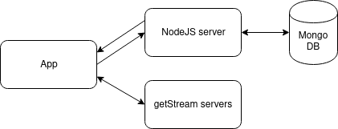
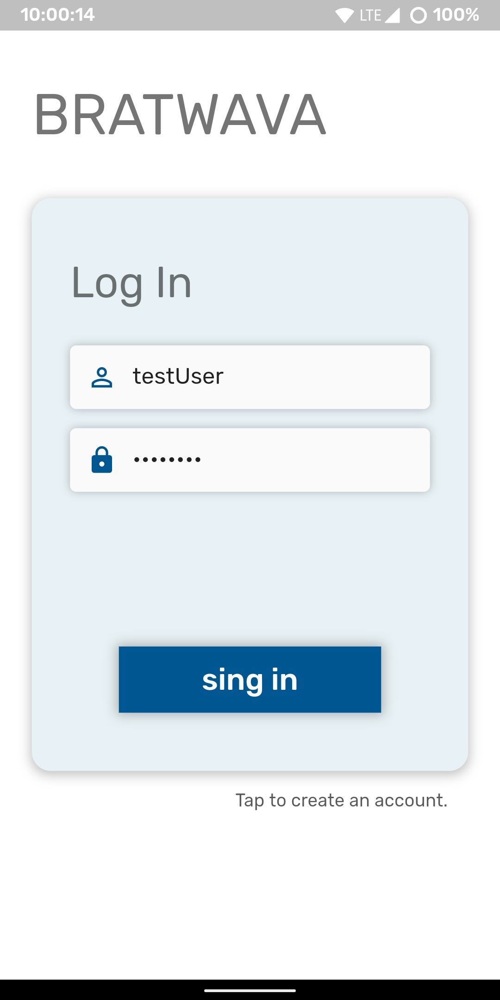
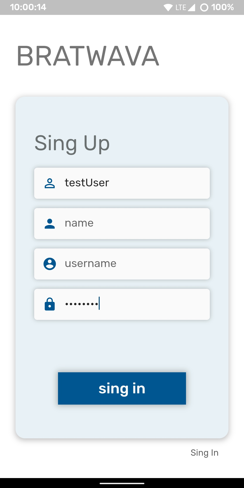
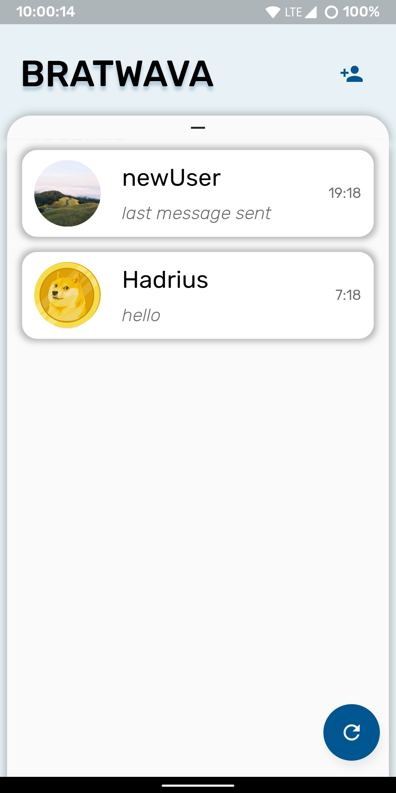
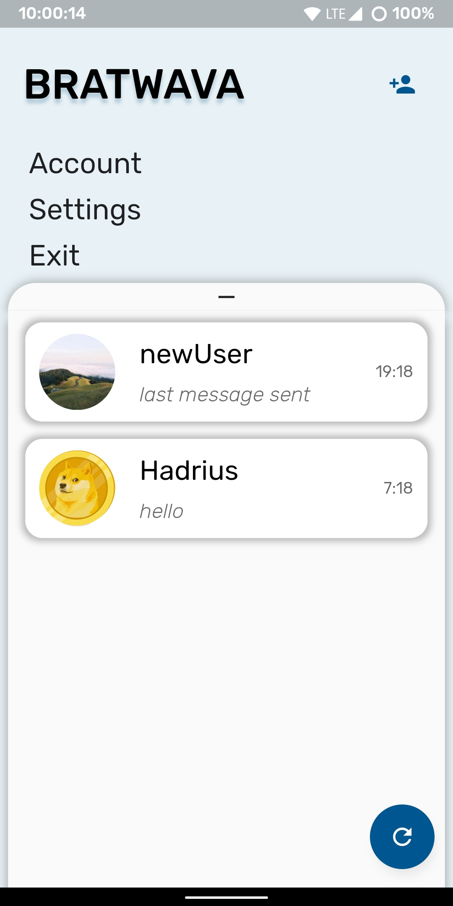
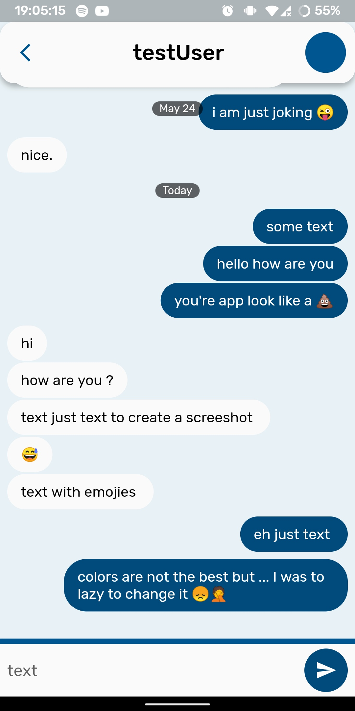
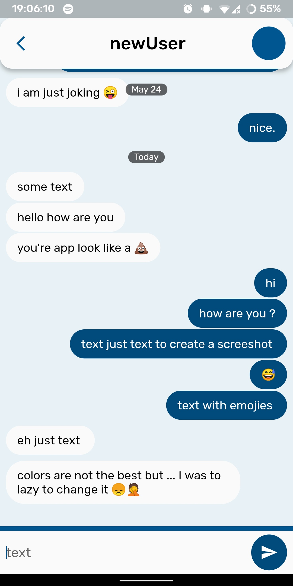

# Bratwava

 ***under development***

*don't pay attention to name. It's the first thing that came to my friend's mind.*

This is a messaging app built using [flutter](https://flutter.dev/) and [getStream](https://getstream.io/). The app consists of two main parts: back-end(node.js) and the app properly. 

id and username are equals

- **NodeJS Server** - is an express app that handles logIn/register requests and generates tokens for accessing getStream Servers. Also it makes connections with MongoDB for processing LogIns and SingUps.  

- **MongoDB** - store all ids, passwords and some specific information such as mail, and name of the user  

- **getStream Servers** - are servers from [getStream.io](https://getstream.io/) to save chats messages and it does the most logic of messaging.  
- **App** - flutter app or front-end for all that stuff.

### App

*here might be description of app and how it works but unfortunately the app right now is just a garbage of code that somehow work* 😑

|  |  |
| ---------------------- | ----------------------- |
|  |   |
|  |   |
